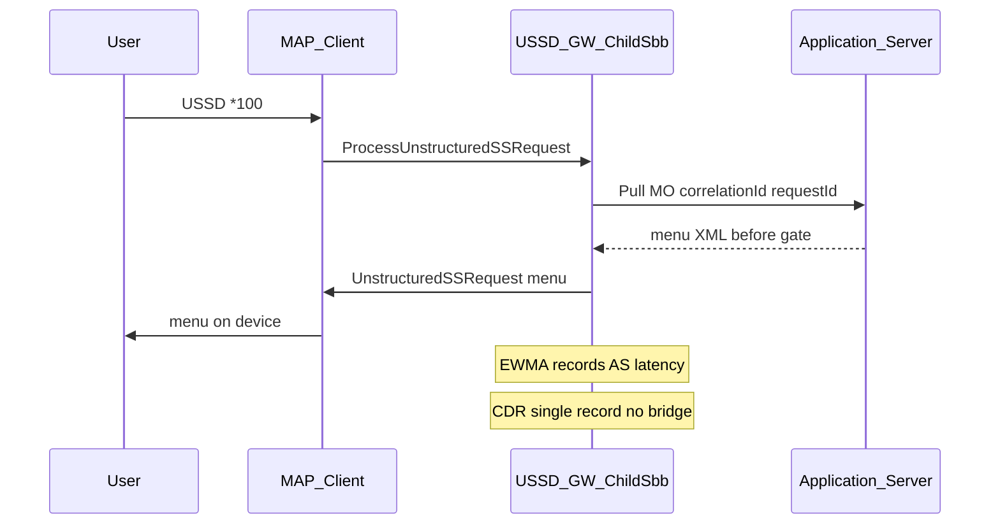
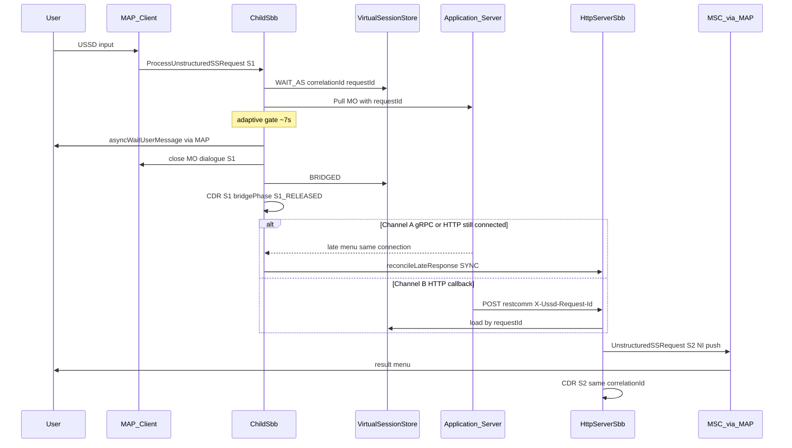
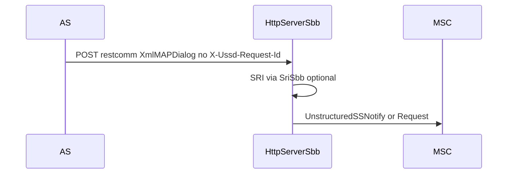
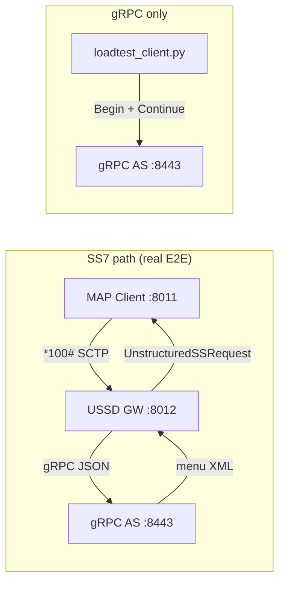

> ይህ ሰነድ ከ [e2e-grpc-ussd-test_en.md](e2e-grpc-ussd-test_en.md) የተተረጎመ ነው።

# የኤንድ-ቱ-ኤንድ ሙከራ መመሪያ — USSD Gateway + gRPC AS

> **ዓላማ፦** ከSS7 አውታረመረብ (የተመሰለ) `*100#` መደወል → USSD Gateway → gRPC Application Server → ባለብዙ-ደረጃ የUSSD ምናሌ → መጨረሻ እሺ።

ሁለት ዋና የመሳሪያ ስብስቦች፦

| መሳሪያ | ቦታ | ሚና |
|------|----------|------|
| **jSS7 MAP Load Client** | `jSS7/map/load` | MAP `ProcessUnstructuredSSRequest` በSCTP/M3UA በኩል መላክ — የSS7 ተመዝጋቢን ያስመስላል |
| **gRPC Python ሞካሪ** | `ussdgateway/tools/grpc-as-tester` | AS አገልጋይ + gRPC ጭነት አመንጪ፤ `grpc_push_client.py` (NI Push → GW `:8453`) |
| **HTTP loadtest** | `ussdgateway/tools/http-simulator/loadtest` | HTTP Pull AS + HTTP Push ጭነት (ራስ-ሰር XML) |

ሦስቱም `menu_config.json` ይጋራሉ (ባለብዙ-ምናሌ፦ Balance / Data / Subscribe)።

**ላብራቶሪውን ለማስኬድ 2 መንገዶች አሉ፦**

| ዘዴ | ማን ይጠቀማል | አስቸጋሪነት |
|--------|-------------|------------|
| **[A] ጥቅል `ussdgw-prod-release`** | ወደ ፕሮዳክሽን አገልጋይ ማሰማራት፣ ማውጣትና ማስኬድ | ⭐ ቀላል — **ይህን ክፍል መጀመሪያ ያንብቡ** |
| **[B] የገንቢ ማሽን** | ከምንጭ `ussdgateway` + `jSS7` መገንባት | ⭐⭐⭐ አስቸጋሪ — በሰነዱ መጨረሻ |

> **ከመስመር ውጪ ጥቅል፦** አስቀድሞ የታሸገው በ `ussdgw-prod-release/` — ይመልከቱ [`ussdgw-prod-release/README.md`](../../ussdgw-prod-release/README.md)።

---

## ከመጀመርዎ በፊት — የሙከራ ፍሰቱን ይረዱ

```
  [MAP Client]  ----SCTP *100#---->  [USSD Gateway]  ----gRPC---->  [Python AS :8443]
       |                                    |                              |
  simulates subscriber                    routing + bridge                  menu Balance/Data/...
```

| # | አካል | የሚሰራበት | ወደብ |
|---|-----------|------------|------|
| 1 | **USSD Gateway** (Docker) | ኮንቴይነር፣ የአስተናጋጅ አውታረመረብ | SCTP **8012**፣ HTTP 8080፣ mgmt **9990** |
| 2 | **gRPC AS** (Python) | ተመሳሳይ አስተናጋጅ ማሽን | **8443** (Pull MO) |
| 2b | **gRPC Push** (gateway አገልጋይ) | በgateway ውስጥ | **8453** (NI Push) |
| 3 | **MAP load client** (Java) | ተመሳሳይ አስተናጋጅ ማሽን | bind SCTP **8011** → call GW **8012** |
| 4 | **HTTP Pull AS** (አማራጭ) | አስተናጋጅ | **8049** (`*519#`) |

**ሁለት ዋና የሙከራ መንገዶች፦**

1. **E2E SS7 → GW → gRPC AS** — jSS7 MAP Load Client ይጠቀሙ (SCTP ወደ gateway ያስፈልጋል)።
2. **gRPC-ብቻ** — `loadtest_client.py` በመጠቀም AS በቀጥታ ይደውሉ (የAS TPS/መዘግየት ይለካሉ፤ MAP የለም)።
3. **HTTP Pull/Push** — gateway ↔ HTTP AS (`*519#`) ወይም ደንበኛ POST ወደ `/restcomm`።

**የግዴታ ቅደም ተከተል፦** Gateway + AS **መጀመሪያ** መስራት አለባቸው፣ ከዚያ MAP client ወይም HTTP ጭነት ያስኪዱ።


### ስምምነት፦ ስክሪፕት አቋራጭ ↔ በእጅ ትዕዛዞች

በዚህ ሰነድ ውስጥ እያንዳንዱ ደረጃ **ሁለት የማስኬጃ መንገዶች** አሉት፦

| ዘዴ | መቼ እንደሚጠቀሙ |
|--------|-------------|
| **ስክሪፕት** (`./scripts/NN-...sh`) | ፈጣን ድግግሞሽ — ብዙ ትዕዛዞችን ያጣምራል፣ venv/PID/log በራስ-ሰር ይፈጥራል |
| **በእጅ አማራጭ** | እያንዳንዱን መሳሪያ ማረም — ሞካሪው **የትኛው መሳሪያ እንደሚጠራ** እና **ያ ትዕዛዝ ምን እንደሚሰራ** በግልጽ ያያል |

- የተለመዱ የአካባቢ ተለዋዋጮች፦ `source ./scripts/env.sh` (ወይም `PKG_ROOT=/opt/ussdgw-prod-release`)።
- ሙሉ የትዕዛዝ ሰንጠረዥ በስክሪፕት → [አባሪ A](#appendix-a--run-each-tool-manually-manual-alternative-to-scripts)።
- ከታች **ደረጃዎች 2–9** ውስጥ፣ **「በእጅ አማራጭ」** ብሎክ ከሚመለከተው የስክሪፕት መስመር በኋላ ወዲያውኑ ይታያል።

---

# [A] በጥቅል `ussdgw-prod-release` ማስኬድ (የሚመከር)

## ደረጃ 0 — አገልጋይ ያዘጋጁ

**በአገልጋይ ላይ የሚያስፈልጉ፦**

- Linux x86_64
- Docker ተጭኗል፣ ባለቤት ተጠቃሚ በ `docker` ቡድን ውስጥ
- `java` (JDK 8) — `java -version` 1.8.x ማሳየት አለበት
- `python3` (3.9–3.12)
- RAM ≥ 6 GB
- የጥቅል ፋይል ተወጥቷል፣ ለምሳሌ፦ `/opt/ussdgw-prod-release/`

```bash
# ያውጡ (እስካሁን ካልተደረገ)
cd /opt
tar xzf ussdgw-prod-release-7.3.1.tar.gz
cd ussdgw-prod-release
```

---

## ደረጃ 1 — የSCTP ከርነል ያንቁ

```bash
lsmod | grep sctp
```

**ማየት አለብዎት** `sctp` ያለው መስመር (ለምሳሌ `sctp 557056 20`)። ካልሆነ፦

```bash
sudo modprobe sctp
lsmod | grep sctp
```

`00-preflight.sh` እና `02-setup-host.sh` እንዲሁ SCTPን በ `lsmod | awk '/^sctp /'` በኩል ያረጋግጣሉ።

---

## ደረጃ 2 — ጥቅሉ ሁሉንም ፋይሎች እንደያዘ ያረጋግጡ

```bash
cd /opt/ussdgw-prod-release          # ሌላ ቦታ ከጫኑት ዱካውን ይቀይሩ
chmod +x scripts/*.sh
./scripts/00-preflight.sh
```

**ሁሉንም `OK` መስመሮች ማየት አለብዎት**፣ `FAIL` የለም።  
`FAIL missing docker tar` ከሆነ → ፋይል `docker/restcomm-ussd-7.2.1-SNAPSHOT.tar` ሲገለበጥ ጠፍቷል።

#### በእጅ አማራጭ (ደረጃ 2)

| # | ትዕዛዝ | ዓላማ |
|---|---------|---------|
| 1 | `chmod +x scripts/*.sh` | የስክሪፕት ማስኬጃ ፍቀድ |
| 2 | `command -v docker && docker info` | Docker CLI + ዴሞን ዝግጁ |
| 3 | `java -version` | JDK 8 (MAP client) |
| 4 | `python3 --version` | ለgRPC/HTTP AS Python |
| 5 | `lsmod \| awk '/^sctp /'` | SCTP ከርነል (MAP/SS7) |
| 6 | `test -f docker/restcomm-ussd-*.tar` | የGateway ምስል tar በጥቅሉ ውስጥ |
| 7 | `test -f tools/jss7-map-load/lib/map-load.jar` | MAP load client ተጠቃልሏል |

---

## ደረጃ 3 — የDocker ምስል ይጫኑ (gatewayን ሳያቆሙ)

```bash
cd /opt/ussdgw-prod-release
./scripts/01-load-docker-image.sh
```

**ነባሪ፦** `docker load` — gateway መስራቱን ይቀጥላል። **መጠባበቂያ `/opt/ussdgw`** → `backups/ussdgw-<timestamp>/ussdgw-host.tgz` (ማውጫው ካለ)።

`gateway/.env`ን ከተለቀቀው መለያ ጋር ይጽፋል (`docker/package.manifest`)።

**የቆዩ ምስሎች** ለመልሶ-ማሽከርከር በማሽኑ ላይ ይቀመጣሉ — በራስ-ሰር አይጠፉም።

```bash
docker images restcomm-ussd
./scripts/01-load-docker-image.sh --list-images
ls backups/
```

| ባንዲራ | መቼ እንደሚጠቀሙ |
|------|----------|
| *(ነባሪ)* | ማሻሻያ አዘጋጁ + አስተናጋጅ መጠባበቂያ |
| `--switch` | መጠባበቂያ + መጫን + gateway እንደገና መፍጠር |
| `--fresh-install` | ላብራቶሪ ዳግም አስጀምር — **ሁሉንም** የቆዩ ምስሎች ሰርዝ |
| `--prune --keep N` | ዲስክ አጽዳ (N ስሪቶች + የሚሰራ + ቀዳሚ ያቆዩ) |
| `--no-backup` | የ`/opt/ussdgw` መጠባበቂያ ዝለል |
| `--list-images` | መለያ + የመቀየሪያ ታሪክ አሳይ |

#### በእጅ አማራጭ (ደረጃ 3 — ምስል መጫን)

`cd /opt/ussdgw-prod-release` እና `source ./scripts/env.sh` ብለው ያስቡ።

| # | ትዕዛዝ | ዓላማ |
|---|---------|---------|
| 1 | `tar -tzf "${DOCKER_TAR}" \| head` | ከመጫንዎ በፊት tar ያረጋግጡ |
| 2 | `docker load -i "${DOCKER_TAR}"` | የ`restcomm-ussd` ምስል ወደ አካባቢያዊ Docker ያስገቡ |
| 3 | `docker images restcomm-ussd` | አሁን የተጫነውን መለያ ያረጋግጡ |
| 4 | `cat gateway/.env` | ለ`docker compose` የሚውል የተለቀቀ መለያ (ስክሪፕቱ ከተጫነ በኋላ ይጽፋል) |

ስለ አስተናጋጅ መጠባበቂያ፣ `--switch`፣ መልሶ-ማሽከርከር ዝርዝሮች → [አባሪ A §A.1–A.3](#a1--load--switch--rollback-docker)።

## ደረጃ 3b — Gateway መቀየር (አጭር መቋረጥ)

```bash
./scripts/03-switch-gateway.sh
```

አስተናጋጅን እንደገና መጠባበቂያ ያድርጉ፣ የቆየ ምስል ወደ `gateway/.env.previous` ያስቀምጡ፣ ኮንቴይነር እንደገና ይፍጠሩ።

## ደረጃ 3c — አዲሱ ስሪት ከተሳሳተ መልሶ-ማሽከርከር

**የDocker ምስል መልሶ-ማሽከርከር፦**

```bash
./scripts/03-switch-gateway.sh --rollback
./scripts/03-switch-gateway.sh --to restcomm-ussd:7.2.1-SNAPSHOT-20260621T120000-abc
./scripts/03-switch-gateway.sh --list-images
```

**የአስተናጋጅ ውቅር መልሶ-ማሽከርከር፦**

```bash
./scripts/02-setup-host.sh --list-backups
sudo ./scripts/02-setup-host.sh --restore backups/ussdgw-20260621T154000Z/
./scripts/03-switch-gateway.sh --rollback
```

**የፕሮዳክሽን ማሻሻያ፦**

```bash
./scripts/01-load-docker-image.sh
./scripts/03-switch-gateway.sh
./scripts/08-check-gateway.sh
# ስህተት ከሆነ፦
./scripts/03-switch-gateway.sh --rollback
sudo ./scripts/02-setup-host.sh --restore backups/ussdgw-<timestamp>/
```

---

## ደረጃ 4 — አስተናጋጅ ማዋቀር (`/opt/ussdgw`)

```bash
sudo ./scripts/02-setup-host.sh
```

የአስተናጋጅ ማውጫዎችን ይፈጥራል፣ የሙከራ config-seed (`*100#` gRPC፣ `*519#` HTTP) ይገለብጣል። `data/` አስቀድሞ ካለ → **በራስ-ሰር መጠባበቂያ** ከመተካቱ በፊት።

| ባንዲራ | ዓላማ |
|------|---------|
| `--list-backups` | መጠባበቂያዎችን ዘርዝር |
| `--restore <dir>` | `/opt/ussdgw` መልሶ አቋቁም |
| `--no-seed` | ማውጫዎችን ብቻ አስጀምር፣ XML አትተካ |

#### በእጅ አማራጭ (ደረጃ 4)

| # | ትዕዛዝ | ዓላማ |
|---|---------|---------|
| 1 | `sudo mkdir -p /opt/ussdgw/{data,logs}` | በአስተናጋጅ ላይ የGateway ማስኪያጃ ማውጫዎች |
| 2 | `sudo cp -a gateway/config-seed/* /opt/ussdgw/data/` | ደንብ `*100#` gRPC፣ `*519#` HTTP፣ የድልድይ XML ዘርቻ |
| 3 | `ls /opt/ussdgw/data/UssdManagement_scroutingrule.xml` | ማዞሪያ መገለበጡን ያረጋግጡ |

ስክሪፕቱ `data/` ካለ በራስ-ሰር መጠባበቂያ ያደርጋል — በእጅ ሲያስኪዱ፣ መጀመሪያ መጠባበቂያ ያድርጉ፦ `sudo tar czf ussdgw-backup.tgz -C / opt/ussdgw`።

---

## ደረጃ 5 — USSD Gatewayን በ`docker compose up` ያስነሱ ⭐

**ይህ የgateway ኮንቴይነርን የሚያስኬድ ደረጃ ነው።** የCompose ፋይል ቦታ፦

```
ussdgw-prod-release/gateway/docker-compose.yml
```

### የማስኪያ ትዕዛዝ (ቅዳ-ለጥፍ)

```bash
cd /opt/ussdgw-prod-release/gateway

# Gateway ያስነሱ (init አገልግሎት መጀመሪያ ይሰራል፣ ከዚያ ussdgw)
docker compose up -d

# ሁኔታ ይመልከቱ
docker compose ps
```

**ማየት አለብዎት** ኮንቴይነር `ussd-prod` ሁኔታ `running` (ወይም `healthy` ከ~3–5 ደቂቃዎች በኋላ)።

### Gateway በህይወት መኖሩን ያረጋግጡ

```bash
# ጤና
curl -fs http://localhost:8080/jolokia/version && echo " OK"

# ማስታወሻ (Ctrl+C ለመውጣት)
docker logs -f ussd-prod
```

የWildFly ማስነሻ ማስታወሻ ለመጀመሪያ ጊዜ **3–5 ደቂቃዎች** ይወስዳል (SLEE ማሰማራት + patch JAR)። ከMAP ሙከራ በፊት ጤና እስኪሆን ይጠብቁ።

```bash
./scripts/08-check-gateway.sh    # ፈጣን ምርመራ
curl -fs http://localhost:8080/jolokia/version && echo " OK"
```

### Gateway ማቆም

```bash
cd /opt/ussdgw-prod-release/gateway
docker compose down
```

### የCompose ማስታወሻዎች

| አገልግሎት | ኮንቴይነር | ሚና |
|---------|-----------|------|
| `init` | `ussd-prod-init` | አንድ ጊዜ ይሰራል፦ `/opt/ussdgw/data` ዘርቻ |
| `ussdgw` | `ussd-prod` | USSD Gateway WildFly |

- `network_mode: host` → SCTP **8012**ን በቀጥታ በአስተናጋጅ ማሽን ላይ ያዳምጣል
- ምስል፦ `restcomm-ussd:7.2.1-SNAPSHOT` (በደረጃ 3 የተጫነ)
- ውቅር፦ `gateway/config-seed/` → `/opt/ussdgw/data/`

> **አቋራጭ፦** `./scripts/03-start-gateway.sh` = `cd gateway && docker compose up -d` + ጤናን መጠበቅ።

#### በእጅ አማራጭ (ደረጃ 5)

| # | ትዕዛዝ | ዓላማ |
|---|---------|---------|
| 1 | `cd /opt/ussdgw-prod-release/gateway` | ወደ compose ማውጫ ይግቡ |
| 2 | `docker compose up -d` | `init` (የውሂብ ዘርቻ) + `ussdgw` (WildFly) ያስነሱ |
| 3 | `docker compose ps` | ኮንቴይነር `ussd-prod` = running/healthy |
| 4 | `curl -fs http://localhost:8080/jolokia/version` | HTTP ጤና — ለመጀመሪያ ጊዜ 3–5 ደቂቃ ይጠብቁ |
| 5 | `docker logs -f ussd-prod` | የSLEE ማሰማራትን ይቆጣጠሩ (አማራጭ) |

ማቆሚያ፦ `cd gateway && docker compose down` (ከ`./scripts/04-stop-gateway.sh` ጋር እኩል)።

---

## ደረጃ 6 — gRPC Application Server (Python) ያስነሱ

Gateway **ጤናማ መሆን አለበት** ይህን ደረጃ ከማስኬድዎ በፊት።

```bash
cd /opt/ussdgw-prod-release
./scripts/05-start-grpc-as.sh
```

**በ`grpc-as.log` ውስጥ ማየት አለብዎት፦**

```
USSD gRPC AS listening on :8443
```

```bash
tail -3 grpc-as.log
```

> **አቋራጭ፦** `sudo ./scripts/start-all.sh` = ደረጃዎች 3 + 4 + 5 + 6 በአንድ ትዕዛዝ ተጣምረው።

#### በእጅ አማራጭ (ደረጃ 6 — gRPC Pull AS)

| # | ትዕዛዝ | ዓላማ |
|---|---------|---------|
| 1 | `cd /opt/ussdgw-prod-release/tools/grpc-as-tester` | የPython AS ማውጫ + `menu_config.json` |
| 2 | `python3 -m venv .venv && .venv/bin/pip install -r requirements.txt` | Venv (የመጀመሪያ ጊዜ ብቻ፤ ከመስመር ውጪ፦ `--find-links wheels`) |
| 3 | `nohup .venv/bin/python ussd_as_server.py --port 8443 --min-delay 1 --max-delay 100 --menu-config menu_config.json > ../../grpc-as.log 2>&1 &` | AS gRPCን ያዳምጣል — gateway ወደ `:8443` **ደንበኛ** ነው |
| 4 | `tail -3 ../../grpc-as.log` | `USSD gRPC AS listening on :8443` ማየት አለብዎት |

AS ማቆሚያ፦ `kill $(cat /opt/ussdgw-prod-release/.grpc-as.pid)` ወይም `./scripts/05-stop-grpc-as.sh`።

---

## ደረጃ 7 — ሙሉ ፍሰት SS7 → Gateway → gRPC ይሞክሩ (MAP አጨስ)

```bash
./scripts/06-run-map-smoke.sh
```

ይህ ትዕዛዝ **10 የUSSD ጥሪዎች** `*100#` ይልካል፣ ምናሌ `BALANCE`ን በራስ-ሰር ይጫናል (`1` ከዚያ `0` ይምረጡ)።

**~30 ሰከንድ – 2 ደቂቃዎች ይጠብቁ** (የመጀመሪያ ጊዜ 20ሰከንድ የSCTP ማስነሻ መዘግየትን ያካትታል)።

የCLI ዝርዝሮች፣ የጭነት ሙከራ፣ ማሞቂያ → [ክፍል 5](#5-e2e-test--tool-1-jss7-map-load-client)።

#### በእጅ አማራጭ (ደረጃ 7 — MAP አጨስ `*100#`)

**ቅድመ-ሁኔታዎች፦** ደረጃ 5 (gateway ጤናማ) + ደረጃ 6 (gRPC AS `:8443`)።

| # | ትዕዛዝ | ዓላማ |
|---|---------|---------|
| 1 | `cd /opt/ussdgw-prod-release/tools/jss7-map-load` | MAP load client (JAR በ `lib/` ውስጥ) |
| 2 | `java -cp "lib/*" org.restcomm.protocols.ss7.map.load.ussd.Client 10 5 sctp 127.0.0.1 8011 -1 127.0.0.1 8012 IPSP 101 102 1 2 3 2 8 6 8 1111112 9960639999 1 4 -100 0 "*100#" BALANCE 50 200` | **10** የSCTP ንግግሮች፣ መገለጫ **BALANCE** (`1`→`0`)፣ ማሰቢያ 50–200 ms፤ gateway `*100#` → gRPC AS ያዞራል |
| 3 | `ls map-*.csv && tail maplog.txt` | ውጤቶች፦ `CompletedScenario`፣ throughput |

የ60 ሰከንድ ማሞቂያ አሰናክል፦ `-Dwarmup=false` ከ`-cp` በፊት ያክሉ። አጭር ኮድ/ወደብ ይቀይሩ፦ `source ../../scripts/env.sh` ከዚያ `"${USSD_SHORT_CODE}"` እና `"${SCTP_GW_PORT}"` ይጠቀሙ።

### ስኬትን እንዴት ማወቅ ይቻላል?

በመጨረሻው ውጤት ውስጥ፣ እንደነዚህ ያሉ መስመሮችን ይፈልጉ፦

```
AS1 is now ACTIVE! Starting load test.
Total completed dialogs = 10
Throughput = ...
```

እና የCSV ፋይል፦

```bash
ls tools/jss7-map-load/map-*.csv
# አምድ CompletedScenario ≈ 10, FailedScenario ዝቅተኛ ወይም 0
```

| ውጤት | ትርጉም |
|--------|---------|
| `AS1 is now ACTIVE` | SCTP Gateway ↔ ደንበኛ እሺ |
| `CompletedScenario` ≈ 10 | 10 የUSSD ክፍለ-ጊዜዎች ተጠናቀዋል |
| `FailedScenario` = 0 | ምንም ስህተቶች የሉም |

**ከተሳሳተ** → [ክፍል 9 — የተለመዱ ስህተቶች](#9-common-errors) ይመልከቱ።

---

## ደረጃ 8 — gRPCን በቀጥታ ይሞክሩ (ያለ SS7)

Python AS + load client ብቻ ይሞክሩ፣ **በGateway በኩል አይደለም**፦

```bash
./scripts/07-run-grpc-smoke.sh
```

**~30 ሰከንድ ይጠብቁ።** ማየት አለብዎት፦

```
  mode             : multi-menu
  completed        : (ቁጥር > 0)
  ok / errors      : X / 0
  achieved TPS     : ...
```

`errors = 0` → AS + ባለብዙ-ምናሌ እሺ። ዝርዝሮች → [ክፍል 6](#6-test--tool-2-grpc-python-loadtest_clientpy)።

#### በእጅ አማራጭ (ደረጃ 8 — gRPC-ብቻ ጭነት)

**ቅድመ-ሁኔታዎች፦** ደረጃ 6 (gRPC AS እየሰራ)። ለዚህ ሙከራ Gateway **አያስፈልግም**።

| # | ትዕዛዝ | ዓላማ |
|---|---------|---------|
| 1 | `cd /opt/ussdgw-prod-release/tools/grpc-as-tester` | ከ`ussd_as_server.py` ጋር ተመሳሳይ venv |
| 2 | `.venv/bin/python loadtest_client.py --target localhost:8443 --tps 50 --duration 30 --multi-menu --profile BALANCE --think-min 50 --think-max 200 --menu-config menu_config.json` | gRPC ደንበኛ ASን **በቀጥታ** ይደውላል — TPS/መዘግየት ባለብዙ-ምናሌ ይለካል፣ MAPን አያልፍም |

ማሞቂያ አሰናክል፦ `--no-warmup` ያክሉ።

---

## ደረጃ 8b — (አማራጭ) gRPC NI Push አጨስ

Gateway **Push NI**ን በgRPC አገልጋይ በኩል ይቀበላል (ወደብ **8453**)። በድር አስተዳደር ላይ ያንቁ → ትር **gRPC Push** → `GrpcPushServerEnabled=true`፣ ወደብ `8453`፣ አገልግሎት `mobicents-ussdgateway-server-grpc` ተሰማርቷል።

```bash
./scripts/14-run-grpc-push-smoke.sh
```

#### በእጅ አማራጭ (ደረጃ 8b)

| # | ትዕዛዝ | ዓላማ |
|---|---------|---------|
| 1 | `http://localhost:9990` ይክፈቱ → Server Settings → gRPC Push | የgateway push አገልጋይ ያንቁ |
| 2 | `curl -fs http://localhost:8080/jolokia/version` | Gateway ጤናማ |
| 3 | `cd /opt/ussdgw-prod-release/tools/grpc-as-tester` | መሳሪያ `grpc_push_client.py` |
| 4 | `.venv/bin/python grpc_push_client.py --target localhost:8453 --mode multi --profile BALANCE --tps 50 --duration 30 --think-min 50 --think-max 200 --menu-config menu_config.json` | ደንበኛ NI push ወደ **gateway** `:8453` ይልካል (MAP የለም) |

---

## ደረጃ 9 — ሁሉንም ያቁሙ

```bash
./scripts/stop-all.sh
```

gRPC AS + Docker gateway ያቁሙ፦

```bash
./scripts/stop-all.sh
# ወይም በእጅ፦
#   cd gateway && docker compose down
```

#### በእጅ አማራጭ (ደረጃ 9)

| # | ትዕዛዝ | ዓላማ |
|---|---------|---------|
| 1 | `kill $(cat /opt/ussdgw-prod-release/.grpc-as.pid 2>/dev/null) 2>/dev/null; rm -f .grpc-as.pid` | gRPC AS ያቁሙ |
| 2 | `kill $(cat /opt/ussdgw-prod-release/.http-as.pid 2>/dev/null) 2>/dev/null; rm -f .http-as.pid` | HTTP Pull AS ያቁሙ (ካለ) |
| 3 | `cd /opt/ussdgw-prod-release/gateway && docker compose down` | Gateway + init ያቁሙ |

---

## (አማራጭ) በSimulator GUI በእጅ ሙከራ

አጨስ ሲወድቅ እና ደረጃ-በ-ደረጃ ማረም ሲያስፈልግ፦

```bash
# ተርሚናል 1፦ ከቆመ ላብራቶሪ እንደገና ያስነሱ
sudo ./scripts/start-all.sh

# ተርሚናል 2፦ አስመሳይ ይክፈቱ
cd tools/jss7-simulator/bin
chmod +x run.sh
./run.sh gui --name=main
# WstxOutputFactory ስህተት ከሆነ → build-package.shን እንደገና ያስኪዱ፤ 00-preflight.sh ያረጋግጡ
```

በGUI መስኮት ውስጥ፦
1. ተግባር **USSD_TEST_CLIENT** ይምረጡ
2. **Start** ይጫኑ / SS7 ያገናኙ
3. USSD ያስገቡ፦ `*100#`
4. ምናሌ ሲታይ → `1` (Balance) → `0` (Exit) ያስገቡ

---

## አባሪ A — እያንዳንዱን መሳሪያ በእጅ ያስኪዱ (ለስክሪፕቶች በእጅ አማራጭ)

ከታች ያለው ሰንጠረዥ **1፦1** እያንዳንዱን ስክሪፕት → በእጅ ትዕዛዝ ያሳያል። `PKG=/opt/ussdgw-prod-release` (ሌላ ቦታ ከተወጣ ይቀይሩ)።

### A.0 — የተለመዱ የአካባቢ ተለዋዋጮች

```bash
cd /opt/ussdgw-prod-release
source ./scripts/env.sh
# ከዚያ፦ $GRPC_AS_DIR, $MAP_LOAD_DIR, $HTTP_LOADTEST_DIR, $SCTP_GW_PORT, ...
```

### A.1 — Docker መጫን / መቀየር / መልሶ-ማሽከርከር

| ስክሪፕት | ዓላማ (ማጠቃለያ) | በእጅ አማራጭ |
|--------|-------------------|-------------------|
| `00-preflight.sh` | docker፣ java፣ python፣ SCTP፣ tar፣ JAR ያረጋግጡ | እያንዳንዱን መስመር በ[ደረጃ 2 — በእጅ አማራጭ](#manual-alternative-step-2) ያስኪዱ |
| `01-load-docker-image.sh` | የ`/opt/ussdgw` መጠባበቂያ + `docker load` | `docker load -i "${DOCKER_TAR}"` → `docker images restcomm-ussd` |
| `03-switch-gateway.sh` | ኮንቴይነርን በአዲስ ምስል እንደገና ይፍጠሩ | `cd gateway && docker compose down && docker compose up -d` (`gateway/.env` ወደ አዲስ መለያ ካመለከተ በኋላ) |
| `03-switch-gateway.sh --rollback` | ምስልን በ`.env.previous` ውስጥ መልሰው ይቀይሩ | `gateway/.env.previous`ን ያንብቡ፣ `USSDGW_IMAGE=...` ወደ `.env` ይመልሱ፣ `compose up -d` |
| `04-stop-gateway.sh` | Gateway ያቁሙ | `cd gateway && docker compose down` |

### A.2 — አስተናጋጅ + gateway

| ስክሪፕት | በእጅ አማራጭ |
|--------|-------------------|
| `02-setup-host.sh` | `sudo mkdir -p /opt/ussdgw/{data,logs}` + `sudo cp -a gateway/config-seed/* /opt/ussdgw/data/` |
| `03-start-gateway.sh` | `cd gateway && docker compose up -d` + `curl -fs http://localhost:8080/jolokia/version` |
| `08-check-gateway.sh` | `docker compose ps` + Jolokia + `docker logs --tail 50 ussd-prod` |

### A.3 — gRPC Pull AS + አጨስ

| ስክሪፕት | # | በእጅ ትዕዛዝ | ዓላማ |
|--------|---|----------------|---------|
| `05-start-grpc-as.sh` | 1 | `cd "${GRPC_AS_DIR}"` | ወደ gRPC መሳሪያ ይግቡ |
| | 2 | `python3 -m venv .venv && .venv/bin/pip install -r requirements.txt` | ጥገኞችን ይጫኑ (የመጀመሪያ ጊዜ) |
| | 3 | `nohup .venv/bin/python ussd_as_server.py --port 8443 --min-delay 1 --max-delay 100 --menu-config menu_config.json > "${PKG_ROOT}/grpc-as.log" 2>&1 &` | ለ**Pull MO** `*100#` AS አገልጋይ |
| `05-stop-grpc-as.sh` | 1 | `kill $(cat "${PKG_ROOT}/.grpc-as.pid")` | የAS ሂደት ያቁሙ |
| `06-run-map-smoke.sh` | 1 | `cd "${MAP_LOAD_DIR}"` | MAP ደንበኛ |
| | 2 | `java -cp "lib/*" org.restcomm.protocols.ss7.map.load.ussd.Client 10 5 sctp 127.0.0.1 8011 -1 127.0.0.1 8012 IPSP 101 102 1 2 3 2 8 6 8 1111112 9960639999 1 4 -100 0 "*100#" BALANCE 50 200` | E2E SS7→GW→gRPC፣ 10 ንግግር |
| `07-run-grpc-smoke.sh` | 1 | `cd "${GRPC_AS_DIR}"` | |
| | 2 | `.venv/bin/python loadtest_client.py --target localhost:8443 --tps 50 --duration 30 --multi-menu --profile BALANCE --think-min 50 --think-max 200 --menu-config menu_config.json` | ASን በቀጥታ ይጫኑ፣ MAP የለም |

### A.4 — HTTP Pull / Push

| ስክሪፕት | # | በእጅ ትዕዛዝ | ዓላማ |
|--------|---|----------------|---------|
| `09-start-http-as.sh` | 1 | `cd "${HTTP_LOADTEST_DIR}"` | HTTP አስመሳይ |
| | 2 | `python3 -m venv .venv && .venv/bin/pip install -r requirements.txt` | Venv (የመጀመሪያ ጊዜ) |
| | 3 | `nohup .venv/bin/python http_as_server.py --port 8049 --min-delay 1 --max-delay 100 --menu-config menu_config.json > "${PKG_ROOT}/http-as.log" 2>&1 &` | **Pull** AS — gateway POST ወደ `:8049` ያደርጋል |
| `12-run-http-pull-smoke.sh` | 1 | `curl -fs http://127.0.0.1:8049/ -o /dev/null -X POST -d ''` | HTTP AS በህይወት መኖሩን ያረጋግጡ |
| | 2 | `cd "${MAP_LOAD_DIR}"` + `java -cp "lib/*" ... "*519#" BALANCE 50 200` | E2E MAP `*519#` → HTTP AS (ተመሳሳይ የSCTP argዎች እንደ ደረጃ 7፣ አጭር ኮድ ይቀይሩ) |
| `13-run-http-push-smoke.sh` | 1 | `cd "${HTTP_LOADTEST_DIR}"` | |
| | 2 | `.venv/bin/python http_push_loadtest.py --target http://127.0.0.1:8080/restcomm --mode multi --profile BALANCE --tps 50 --duration 30 --think-min 50 --think-max 200 --menu-config menu_config.json` | **Push NI** — ደንበኛ XmlMAP ወደ gateway POST ያደርጋል |

ሙሉ የMAP ትዕዛዝ ለ `*519#`፦

```bash
cd "${MAP_LOAD_DIR}"
java -cp "lib/*" org.restcomm.protocols.ss7.map.load.ussd.Client \
  10 5 sctp 127.0.0.1 8011 -1 127.0.0.1 8012 IPSP 101 102 1 2 3 2 8 6 8 \
  1111112 9960639999 1 4 -100 0 "*519#" BALANCE 50 200
```

### A.5 — gRPC NI Push

| ስክሪፕት | # | በእጅ ትዕዛዝ | ዓላማ |
|--------|---|----------------|---------|
| `14-run-grpc-push-smoke.sh` | 1 | gRPC Pushን በድር አስተዳደር `:9990` ላይ ያንቁ | Gateway **8453**ን ያዳምጣል |
| | 2 | `cd "${GRPC_AS_DIR}"` | |
| | 3 | `.venv/bin/python grpc_push_client.py --target localhost:8453 --mode multi --profile BALANCE --tps 50 --duration 30 --think-min 50 --think-max 200 --menu-config menu_config.json` | Push NIን በgRPC በኩል ወደ gateway ይላኩ |

### A.6 — ላብራቶሪ ማስነሳት / ማቆም

| ስክሪፕት | በእጅ አማራጭ (በቅደም ተከተል) |
|--------|-------------------------------|
| `start-all.sh` | `00-preflight` → `01-load` → `sudo 02-setup` → `03-start-gateway` → `05-start-grpc-as` |
| `stop-all.sh` | `05-stop-grpc-as` → `09-stop-http-as` → `04-stop-gateway` |

---

## እያንዳንዱን ደረጃ ለየብቻ ያስኪዱ (ፈጣን የስክሪፕት ማጣቀሻ)

| ደረጃ | ስክሪፕት | ማጠቃለያ | የበእጅ ትዕዛዝ ዝርዝሮች |
|------|--------|---------|------------------------|
| ቅድመ-በረራ | `00-preflight.sh` | አካባቢን ያረጋግጡ | [A.1](#a1--load--switch--rollback-docker) |
| ምስል ጫን | `01-load-docker-image.sh` | `docker load` + መጠባበቂያ | [A.1](#a1--load--switch--rollback-docker) |
| GW ቀይር | `03-switch-gateway.sh` | ኮንቴይነር እንደገና ፍጠር | [A.1](#a1--load--switch--rollback-docker) |
| አስተናጋጅ አዋቅር | `02-setup-host.sh` | `/opt/ussdgw` ዘርቻ | [A.2](#a2--host--gateway) |
| **GW አስነሳ** | `03-start-gateway.sh` | `docker compose up -d` | [A.2](#a2--host--gateway) |
| gRPC AS አስነሳ | `05-start-grpc-as.sh` | `ussd_as_server.py :8443` | [A.3](#a3--grpc-pull-as--smoke) |
| MAP አጨስ | `06-run-map-smoke.sh` | `*100#` × 10 | [A.3](#a3--grpc-pull-as--smoke) |
| gRPC አጨስ | `07-run-grpc-smoke.sh` | `loadtest_client.py` | [A.3](#a3--grpc-pull-as--smoke) |
| HTTP AS አስነሳ | `09-start-http-as.sh` | `http_as_server.py :8049` | [A.4](#a4--http-pull--push) |
| HTTP Pull አጨስ | `12-run-http-pull-smoke.sh` | MAP `*519#` × 10 | [A.4](#a4--http-pull--push) |
| HTTP Push አጨስ | `13-run-http-push-smoke.sh` | Push 50 TPS × 30ሰ | [A.4](#a4--http-pull--push) |
| gRPC Push አጨስ | `14-run-grpc-push-smoke.sh` | Push gRPC 50 TPS × 30ሰ | [A.5](#a5--grpc-ni-push) |
| ሁሉም | `start-all.sh` | ደረጃዎች 1→6 ተጣምረዋል | [A.6](#a6--start-stop-lab) |

---

# [B] ከምንጭ ማስኬድ (የገንቢ ማሽን — ያለ ጥቅል)

ይህን የሚጠቀሙት በሚገነቡበት ጊዜ ብቻ ነው፣ `ussdgw-prod-release` ፋይል **የለም**።

## B.1 — መገንባት (አንድ ጊዜ)

```bash
# የGateway ምስል (Maven SLEE + ant + docker — የEclipse stub JAR ያስወግዱ)
cd ussdgateway/release-wildfly && ./build-docker.sh

# MAP load client
cd jSS7/map/load && mvn clean package -Passemble -DskipTests

# SS7 አስመሳይ (በlib/ ውስጥ woodstox ያስፈልገዋል)
cd jSS7 && mvn install -pl tools/simulator -am -Dmaven.test.skip=true

# Python AS + HTTP loadtest
cd ussdgateway/tools/grpc-as-tester
python3 -m venv .venv && ./.venv/bin/pip install -r requirements.txt
cd ../http-simulator/loadtest && pip install -r requirements.txt
```

## B.2 — ተርሚናል 1፦ Gateway (docker compose)

```bash
sudo modprobe sctp

cd /path/to/ussdgw-prod-release/gateway
docker compose up -d
docker compose ps
curl -fs http://localhost:8080/jolokia/version && echo " OK"
```

ወይም ከምንጭ ዛፍ (ከ`./build-docker.sh` በኋላ)፦

```bash
cd ussdgateway/release-wildfly
sudo ./setup-server.sh
docker compose up -d
```

## B.3 — ተርሚናል 2፦ gRPC AS

```bash
cd ussdgateway/tools/grpc-as-tester
./.venv/bin/python ussd_as_server.py \
  --port 8443 \
  --min-delay 1 --max-delay 100 \
  --menu-config menu_config.json
```

## B.4 — ተርሚናል 3፦ MAP አጨስ

**ጥቅል (`ussdgw-prod-release`)፦**

```bash
cd ussdgw-prod-release/tools/jss7-map-load
java -cp "lib/*" org.restcomm.protocols.ss7.map.load.ussd.Client \
  10 5 sctp 127.0.0.1 8011 -1 127.0.0.1 8012 IPSP 101 102 1 2 3 2 8 6 8 \
  1111112 9960639999 1 16 -100 0 "*100#" BALANCE 50 200
```

**የjSS7 ምንጭ፦**

```bash
cd jSS7/map/load
java -cp "target/load/*" org.restcomm.protocols.ss7.map.load.ussd.Client \
  10 5 sctp 127.0.0.1 8011 -1 127.0.0.1 8012 IPSP 101 102 1 2 3 2 8 6 8 \
  1111112 9960639999 1 16 -100 0 "*100#" BALANCE 50 200
```

> የአቻ ወደብ = **8012** gateway `network_mode: host` ሲጠቀም። Docker SCTP `2905:2905/sctp` ካሳየ → `2905` ይጠቀሙ።

---

# 5. E2E ሙከራ — መሳሪያ 1፦ jSS7 MAP Load Client

ፍሰት፦ **MAP client → Gateway SCTP → gRPC AS → ባለብዙ-ዙር ምናሌ → መጨረሻ**።

### 5.1 የአጨስ ሙከራ (አንድ መገለጫ፣ ጥቂት ንግግሮች)

**ከጥቅል `ussdgw-prod-release`** (classpath `lib/*`)፦

```bash
cd ussdgw-prod-release/tools/jss7-map-load
java -cp "lib/*" org.restcomm.protocols.ss7.map.load.ussd.Client \
  10 5 sctp 127.0.0.1 8011 -1 127.0.0.1 8012 IPSP 101 102 1 2 3 2 8 6 8 \
  1111112 9960639999 1 16 -100 0 "*100#" BALANCE 50 200
```

ወይም፦ `./scripts/06-run-map-smoke.sh`

**ከjSS7 ምንጭ** (classpath `target/load/*`)፦

```bash
cd jSS7/map/load
java -cp "target/load/*" org.restcomm.protocols.ss7.map.load.ussd.Client \
  10 5 sctp 127.0.0.1 8011 -1 127.0.0.1 8012 IPSP 101 102 1 2 3 2 8 6 8 \
  1111112 9960639999 1 16 -100 0 "*100#" BALANCE 50 200
```

| መለኪያ (ቦታ) | ምሳሌ | ትርጉም |
|----------------------|---------|---------|
| 1–2 | `10` `5` | 10 ንግግሮች፣ 5 በተመሳሳይ ጊዜ |
| 25 | `*100#` | ከgRPC ማዞሪያ ደንብ ጋር የሚዛመድ አጭር ኮድ |
| 26 | `BALANCE` | የምናሌ መገለጫ |
| 27–28 | `50` `200` | የማሰቢያ መዘግየት ms (adaptive gate) |

### 5.2 ባለብዙ-ምናሌ ጭነት ሙከራ

**ጥቅል (`lib/*`)፦**

```bash
cd ussdgw-prod-release/tools/jss7-map-load
java -cp "lib/*" org.restcomm.protocols.ss7.map.load.ussd.Client \
  100000 400 sctp 127.0.0.1 8011 -1 127.0.0.1 8012 IPSP 101 102 1 2 3 2 8 6 8 \
  1111112 9960639999 1 16 -100 5 "*100#" RANDOM 50 300
```

**የjSS7 ምንጭ (`target/load/*`)፦**

```bash
cd jSS7/map/load
java -cp "target/load/*" org.restcomm.protocols.ss7.map.load.ussd.Client \
  100000 400 sctp 127.0.0.1 8011 -1 127.0.0.1 8012 IPSP 101 102 1 2 3 2 8 6 8 \
  1111112 9960639999 1 16 -100 5 "*100#" RANDOM 50 300
```

መለኪያ 24 = `5` → **5 ደቂቃዎች** ያስኪዱ (የቆይታ ሁነታ)።

Metrics CSV፦ `map-*.csv` በስራ ማውጫ ውስጥ (`CreatedScenario`፣ `CompletedScenario`፣ `FailedScenario`)።

### 5.3 የስኬት መስፈርቶች

- [ ] የደንበኛ ማስታወሻ፦ `AS1 is now ACTIVE`፣ የthroughput ሪፖርት በመጨረሻ
- [ ] `CompletedScenario` ≈ የተጠናቀቁ ንግግሮች ብዛት፤ `FailedScenario` ዝቅተኛ
- [ ] የGateway ማስታወሻ፦ gRPC ASን ይደውላል፤ ለ`*100#` `no routing rule` የለም
- [ ] የAS ማስታወሻ፦ ብዙ ክፍለ-ጊዜዎች ከበርካታ የምናሌ ዙሮች ጋር
- [ ] CDR (ከነቃ)፦ S1/S2 ድልድይ ሲነቃ

### 5.4 TPS ማሞቂያ (MAP — በነባሪ የበራ)

ሁሉም የጭነት አመንጪዎች **TPSን በመጀመሪያዎቹ 60 ሰከንዶች** ውስጥ ደረጃ በደረጃ ያሳድጋሉ የተዋቀረው ኢላማ ላይ ከመድረሳቸው በፊት። ደረጃዎች፦ `1 → 100 → 500 → 1000 → 2000 → 3000 → 5000 → 7000 → 10000` (በ`--tps` / `MAXCONCURRENTDIALOGS` የተገደበ)። JVM/SLEE/TCAP ዝግጁ ከመሆኑ በፊት ሙሉ ፍጥነት በUSSD GW ላይ እንዳይመታ ያደርጋል።

| መሳሪያ | ማሞቂያ አሰናክል |
|------|----------------|
| gRPC `loadtest_client.py` | `--no-warmup` |
| HTTP `http_push_loadtest.py` | `--no-warmup` |
| MAP `Client.java` | `-Dwarmup=false` |

ኢላማ 5000 TPS ሲሆን የሚታይ ምሳሌ ውጤት፦

```
warmup 60s: 1 → 100 → 500 → 1000 → 2000 → 3000 → 5000 TPS
```

MAP client ተመሳሳይ ማጠቃለያ በማስነሻ ጊዜ በ`WarmupRateHelper` በኩል ያትማል።

**MAP ጭነት ከተሰናከለ ማሞቂያ ጋር፦**

```bash
java -Dwarmup=false -cp "lib/*" org.restcomm.protocols.ss7.map.load.ussd.Client \
  ... # ከላይ እንደነበሩት ተመሳሳይ መለኪያዎች
```

---

# 6. ሙከራ — መሳሪያ 2፦ gRPC Python (`loadtest_client.py`)

ፍሰት፦ **Load client → gRPC AS በቀጥታ** (MAP የለም)። ለሚከተሉት ያገለግላል፦

- ASን ብቻውን መለካት (TPS/መዘግየት)
- በgRPC ደረጃ ባለብዙ-ምናሌ መሞከር (ተመሳሳይ `menu_config.json`)

### 6.1 ነጠላ-ምት (ጀምር ብቻ — ከፍተኛ throughput)

```bash
cd ussdgateway/tools/grpc-as-tester
./.venv/bin/python loadtest_client.py \
  --target localhost:8443 \
  --tps 1000 --duration 10
```

ማሞቂያ 60ሰ በነባሪ የበራ — በ`--duration 10` በ10ሰ ውስጥ ብቻ ደረጃ በደረጃ ከፍ ይላል ከዚያ ይቆማል።

### 6.2 ባለብዙ-ምናሌ ሙሉ ክፍለ-ጊዜ

```bash
./.venv/bin/python loadtest_client.py \
  --target localhost:8443 \
  --tps 200 --duration 30 \
  --multi-menu --profile BALANCE \
  --think-min 50 --think-max 200 \
  --menu-config menu_config.json
```

መገለጫዎች፦ `BALANCE`፣ `DATA`፣ `SUBSCRIBE`፣ `RANDOM`።

የሚታይ ምሳሌ ውጤት፦

```
  mode             : multi-menu
  completed        : 5842
  achieved TPS     : 194
  latency p95 (ms) : 12.34
  warmup 60s: 1 → 100 → 200 TPS
```

ከ`ussdgw-prod-release`፦

```bash
./scripts/07-run-grpc-smoke.sh
```

**ማሞቂያ አሰናክል — ሙሉ TPS ከመጀመሪያው፦**

```bash
./.venv/bin/python loadtest_client.py \
  --target localhost:8443 \
  --tps 1000 --duration 30 \
  --no-warmup
```

### 6.3 የመሳሪያ ንጽጽር

| | MAP Load Client | gRPC loadtest_client |
|--|-----------------|----------------------|
| መግቢያ | SCTP/MAP | gRPC unary |
| የgateway ማዞሪያ መሞከር | ✓ | ✗ |
| MAP dialogue / TCAP መሞከር | ✓ | ✗ |
| gRPC AS ምናሌ መሞከር | ✓ (በGW በኩል) | ✓ (በቀጥታ) |
| ባለብዙ-ምናሌ | ✓ መገለጫዎች | ✓ `--multi-menu` |
| ተለዋዋጭ መዘግየት | የማሰቢያ መዘግየት + AS መዘግየት | `--think-min/max` + AS መዘግየት |
| TPS ማሞቂያ | በነባሪ የበራ (`-Dwarmup=false`) | በነባሪ የበራ (`--no-warmup`) |

---

# 7. ሙከራ — መሳሪያ 3፦ HTTP (`http-simulator/loadtest`)

XmlMAPDialogን በራስ-ሰር ያመነጫል (በእጅ XML አያስፈልግም)። ተመሳሳይ `menu_config.json` እና መገለጫዎች እንደ gRPC/MAP።

| ስክሪፕት | ሁኔታ | አቅጣጫ |
|--------|----------|-----------|
| `http_as_server.py` | **Pull** (MO) | Gateway POST → AS `:8049`ን ያዳምጣል |
| `http_push_loadtest.py` | **Push** (NI) | ደንበኛ POST → gateway `/restcomm` |

ማዞሪያ፦ `*519#` → `http://127.0.0.1:8049/` (HTTP pull)። Push URL፦ `http://127.0.0.1:8080/restcomm`።

ጥቅል `ussdgw-prod-release` ደንብ `*519#`ን በ`gateway/config-seed/` ውስጥ አስቀድሞ ይዘራል።

### 7.1 HTTP Pull — AS አስነሳ + MAP አጨስ

```bash
# ተርሚናል፦ HTTP Pull AS (adaptive delay 1–100 ms)
cd ussdgateway/tools/http-simulator/loadtest
pip install -r requirements.txt
python3 http_as_server.py --port 8049 --min-delay 1 --max-delay 100

# ድልድይ / adaptive timeout:
python3 http_as_server.py --port 8049 --bridge-delay 8000 --bridge-every 10
```

ከ`ussdgw-prod-release` (gateway + MAP client አስቀድሞ እየሰሩ)፦

```bash
./scripts/09-start-http-as.sh
./scripts/12-run-http-pull-smoke.sh    # 10 ንግግር, *519#, BALANCE
```

#### በእጅ አማራጭ (7.1)

| # | ትዕዛዝ | ዓላማ |
|---|---------|---------|
| 1 | `cd /opt/ussdgw-prod-release && source scripts/env.sh` | ተለዋዋጮች `$HTTP_LOADTEST_DIR`፣ `$MAP_LOAD_DIR` |
| 2 | `cd "${HTTP_LOADTEST_DIR}" && python3 -m venv .venv && .venv/bin/pip install -r requirements.txt` | HTTP AS venv (የመጀመሪያ ጊዜ) |
| 3 | `nohup .venv/bin/python http_as_server.py --port 8049 --min-delay 1 --max-delay 100 --menu-config menu_config.json > ../../http-as.log 2>&1 &` | HTTP Pull AS — gateway MO እዚህ POST ያደርጋል |
| 4 | `cd "${MAP_LOAD_DIR}"` | MAP ደንበኛ |
| 5 | `java -cp "lib/*" org.restcomm.protocols.ss7.map.load.ussd.Client 10 5 sctp 127.0.0.1 8011 -1 127.0.0.1 8012 IPSP 101 102 1 2 3 2 8 6 8 1111112 9960639999 1 4 -100 0 "*519#" BALANCE 50 200` | 10 ንግግሮች `*519#` በSCTP በኩል → gateway → HTTP AS |

የድልድይ ሙከራ፦ ደረጃ 3ን በ`http_as_server.py --port 8049 --bridge-delay 8000 --bridge-every 10` ይተኩ።

### 7.2 HTTP Push — 1000 TPS ጭነት

```bash
cd ussdgateway/tools/http-simulator/loadtest
python3 http_push_loadtest.py \
  --target http://127.0.0.1:8080/restcomm \
  --mode multi --profile BALANCE \
  --tps 1000 --duration 30 \
  --think-min 50 --think-max 200
```

ሁነታዎች፦ `notify` (USSD notify ብቻ)፣ `request` / `multi` (ባለብዙ-ደረጃ NI ምናሌ፣ XML በራስ-ሰር የተሰራ)።

ከ`ussdgw-prod-release`፦

```bash
./scripts/13-run-http-push-smoke.sh    # አጨስ 50 TPS × 30ሰ
```

#### በእጅ አማራጭ (7.2 — አጨስ 50 TPS)

| # | ትዕዛዝ | ዓላማ |
|---|---------|---------|
| 1 | `cd /opt/ussdgw-prod-release/tools/http-simulator/loadtest` | የPush መሳሪያ (venvን ከ`09-start-http-as` ጋር ማጋራት ይችላል) |
| 2 | `.venv/bin/python http_push_loadtest.py --target http://127.0.0.1:8080/restcomm --mode multi --profile BALANCE --tps 50 --duration 30 --think-min 50 --think-max 200 --menu-config menu_config.json` | ደንበኛ XmlMAPDialogን በራስ-ሰር ይገነባል፣ **NI**ን ወደ gateway `/restcomm` POST ያደርጋል |

ከፍተኛ ጭነት 1000 TPS፦ `--tps 1000` ይቀይሩ (gateway ጤናማ ይሁን)። ማሞቂያ አሰናክል፦ `--no-warmup`።

**ማሞቂያ አሰናክል፦**

```bash
python3 http_push_loadtest.py \
  --target http://127.0.0.1:8080/restcomm \
  --mode multi --profile BALANCE \
  --tps 1000 --duration 30 \
  --no-warmup
```

### 7.3 HTTP ንጽጽር

| | HTTP Pull AS | HTTP Push loadtest | MAP + HTTP |
|--|--------------|-------------------|------------|
| መግቢያ | HTTP POST ከGW | HTTP POST ወደ GW | SCTP `*519#` |
| XML | ከምናሌ በራስ-ሰር | ከምናሌ በራስ-ሰር | SS7 + HTTP AS |
| 1000 TPS | የAS thread pool | `--tps 1000` | MAP ጭነት + HTTP AS |
| Adaptive / bridge | `--min/max-delay`፣ `--bridge-delay` | በpush ደረጃዎች መካከል የማሰቢያ መዘግየት | በMAP client ውስጥ የማሰቢያ መዘግየት |
| TPS ማሞቂያ | — (MAP client ramp) | በነባሪ የበራ (`--no-warmup`) | MAP ማሞቂያ |

የSimulator Swing GUI (በእጅ XML)፦ `tools/http-simulator/bin/run.sh` — እንዲሁም በ`ussdgw-prod-release/tools/http-simulator/` ውስጥ።

---

# 8. ተለዋዋጭ timeout እና Virtual Session Bridge (ቁልፍ ባህሪ)

ይህ ክፍል ለUSSD Gateway **ዋናው የመቀበያ መስፈርት** ነው፦ በከፍተኛ ጭነት ውስጥ፣ gateway የMAP ንግግሮችን የተረጋጋ ማድረግ አለበት፣ **የAS መጠበቂያ በርን** ከትክክለኛው መዘግየት ጋር **ማስተካከል** አለበት፣ እና ተመዝጋቢውን ከማጣት ይልቅ **የዘገዩ AS ምላሾችን** በNI push በኩል **መልሶ ማግኘት** አለበት።

የንድፍ ሰነዶች፦ [`docs/design/virtual-session-bridge.md`](design/virtual-session-bridge.md)፣ [`docs/design/bridge-unified-reconciliation-rfc.md`](design/bridge-unified-reconciliation-rfc.md)።

### 8.1 ባህሪው ምን እንደሚሰራ

| ዘዴ | ዓላማ |
|-----------|---------|
| **Adaptive gate (EWMA)** | ተንቀሳቃሽ አማካይ የAS መዘግየት በ`networkId` → ተለዋዋጭ በር በ`[1000 ms, asyncGateTimeoutMs]` ውስጥ፦ ፈጣን AS → አጭር በር፤ በቋሚነት ቀርፋፋ AS → ረዘም ያለ በር (ከውቅር ጣሪያ አይበልጥም)። |
| **Virtual Session Bridge** | በር ከAS ምላሽ በፊት በ**Pull MO** ላይ ጊዜው ካለፈ → የMAP S1ን ቀድመው ይልቀቁ፣ `asyncWaitUserMessage` ያሳዩ፣ virtual session በመሸጎጫ ውስጥ ያስቀምጡ፣ ውጤቱን በኋላ በ**NI push S2** በኩል ያስረክቡ። |
| **Unified reconciliation** | የዘገየ AS ምላሽ በ**Channel A** (ተመሳሳይ gRPC/HTTP MO ግንኙነት) ወይም **Channel B** (`POST /restcomm` + ራስጌ `X-Ussd-Request-Id`) በ`requestId` አማካይነት ይመሳሰላል። |

**በዚህ ባህሪ ውስጥ Pull vs Push፦**

| መንገድ | ቀስቃሽ | SBB | የድልድይ ሚና |
|------|---------|-----|-------------|
| **Pull MO** | ተመዝጋቢ `*100#` / `*519#` ይደውላል | `ChildSbb` → HTTP/gRPC/SIP | በMAP ACI ላይ የበር ሰዓት ቆጣሪ፤ S1 መልቀቂያ + S2 NI push AS ቀርፋፋ ሲሆን |
| **Push NI (ቀዝቃዛ)** | AS POST ያለ `X-Ussd-Request-Id` | `HttpServerSbb` | መደበኛ NI push — ያለፈ MO ድልድይ የለም |
| **Push NI (bridge S2)** | AS POST **ከ** `X-Ussd-Request-Id` ጋር | `HttpServerSbb` | ከተድልድየ Pull MO በኋላ ምናሌ ማስረከብ |

### 8.2 የTimeout ተዋረድ (በትክክለኛ ቅደም ተከተል መሆን አለበት)

ጥቅል `ussdgw-prod-release` ድልድይን በ[`gateway/config-seed/UssdManagement_ussdproperties.xml`](../../ussdgw-prod-release/gateway/config-seed/UssdManagement_ussdproperties.xml) ውስጥ ያነቃል፦

```xml
<sessionbridgeenabled>true</sessionbridgeenabled>
<asyncgatetimeoutms>7000</asyncgatetimeoutms>
<dialogtimeout>60000</dialogtimeout>
<!-- TCAP: TcapStack_management.xml dialogTimeout=90000 -->
<asyncwaitusermessage>ስርዓቱ ስራ ላይ ነው፣ በቅርቡ ያሳውቅዎታል</asyncwaitusermessage>
<bridgestatettlsec>180</bridgestatettlsec>
```

**ገደቦች (ላብራቶሪ + ፕሮዳክሽን)፦**

```
1000 ms ≤ adaptiveGate ≤ asyncGateTimeoutMs (7000) < dialogTimeout (60000) < TCAP dialogTimeout (90000)
bridgeStateTtlSec (180) ≥ የዘገየ AS መስኮት + push ድጋሚ ሙከራ
```

| ንብረት | ነባሪ (ጥቅል) | ትርጉም |
|----------|-------------------|---------|
| `sessionBridgeEnabled` | `true` | ዋና ማብሪያ፤ `false` = የቆየ ጠንካራ timeout |
| `asyncGateTimeoutMs` | `7000` | የተለዋዋጭ በር ጣሪያ፤ MO በሩ ጊዜው ሲያልፍ ይለቀቃል |
| `dialogTimeout` | `60000` | ድልድይ ሲጠፋ ወይም ከበር በኋላ የመተግበሪያ ሰዓት ቆጣሪ |
| `asyncWaitUserMessage` | (ዘርቻ) | S1ን ሲለቅቁ የሚታይ USSD፣ AS አሁንም እየሰራ ነው |
| `asyncHardFailMessage` | (ዘርቻ) | AS ሙሉ በሙሉ ሲወድቅ የሚታይ USSD |
| `bridgeStateTtlSec` | `180` | Virtual session TTL በመሸጎጫ ውስጥ |
| `pushRetryDelaysMs` | `3000,8000,15000` | MSC ስራ ላይ ሲሆን ወደኋላ-መመለስ ድጋሚ ሙከራ NI push |

**በAS-በኩል መለኪያዎች (ሁሉም የጭነት መሳሪያዎች)፦**

| ባንዲራ | መሳሪያ | ውጤት |
|------|------|--------|
| `--min-delay` / `--max-delay` | gRPC `ussd_as_server.py`፣ HTTP `http_as_server.py` | የዘፈቀደ መዘግየት → የEWMA adaptive gateን ይመግባል |
| `--bridge-delay MS` | ተመሳሳይ | ከበር የሚረዝም ቋሚ መዘግየት (ከበር 7000 ms ጋር `8000` ይጠቀሙ) |
| `--bridge-every N` | ተመሳሳይ | ለ1-ከ-N ጥያቄዎች የድልድይ መዘግየት (`1`=ሁልጊዜ፣ `10`=10%) |

**የጭነት አመንጪ መለኪያዎች፦**

| ባንዲራ | መሳሪያ | ከፍተኛ-ጭነት / ድልድይ እሴቶች |
|------|------|---------------------------|
| `--tps` | `loadtest_client.py`፣ `http_push_loadtest.py` | `200`–`1000` (ማሞቂያ በነባሪ የበራ) |
| `--duration` | ተመሳሳይ | `300` (5 ደቂቃዎች) |
| `--multi-menu` / መገለጫ `ADAPTIVE` | gRPC load / MAP | ባለብዙ-ዙር + ተለዋዋጭ የማሰቢያ ጊዜ |
| `--think-min` / `--think-max` | gRPC፣ HTTP push፣ MAP arg 27–28 | `50` / `300` ms |
| `--warmup` (በነባሪ የበራ) | ሁሉም የጭነት መሳሪያዎች | 60 ሰ ደረጃ — 1000 TPS ከመገምገምዎ በፊት **የግድ ያስፈልጋል** |
| `-Dwarmup=false` | MAP Client | ደረጃን አሰናክል (ቅጽበታዊ ጭንቀት) |

### 8.3 የጥሪ ፍሰት — Pull MO (gRPC / HTTP)

#### 8.3.1 ፈጣን S1 (AS ከበር በፊት ምላሽ ይሰጣል)



#### 8.3.2 S2 ድልድይ (AS ከበር የቀነዘ — ቁልፍ ሁኔታ)



**gRPC፦** AS **`requestId`ን በJSON ፖስታ ውስጥ ማስተጋባት አለበት** ([`ussd_envelope.py`](../tools/grpc-as-tester/ussd_envelope.py))። Channel A በ`GrpcClientSbb` ውስጥ የMAP ንግግር አስቀድሞ ሲዘጋ ይያዛል።

**HTTP Pull፦** `http_as_server.py --bridge-delay 8000` **ተመሳሳዩን የPOST ምላሽ** ያዘገየዋል (Channel A)። Channel B፦ AS POST ወደ `http://127.0.0.1:8080/restcomm` + ራስጌ `X-Ussd-Request-Id` (RFC §5)።

### 8.4 የጥሪ ፍሰት — Push NI

#### 8.4.1 ቀዝቃዛ NI push (ያለፈ MO የለም)



#### 8.4.2 የድልድይ መልሶ-ማግኛ push (S2 ከቀነዘ Pull MO በኋላ)

ተመሳሳይ URL **`POST /restcomm`**፣ AS **`X-Ussd-Request-Id`** ከMO ጥያቄ ጋር የሚዛመድ ይልካል። `HttpServerSbb` `reconcileLateResponse()`ን ይጠራል → NI push ከ**`correlationId` ጋር S1 CDRን አገናኝቶ**።

### 8.5 አጨስ (ተግባራዊ፣ ዝቅተኛ TPS)

Gateway ጤናማ ከሆነ + AS ከተነሳ በኋላ ያስኪዱ። ዓላማ፦ ከከፍተኛ ጭነት በፊት ድልድይን ማረጋገጥ።

#### 8.5.1 gRPC Pull — አንድ የድልድይ ንግግር

**ስክሪፕት፦**

```bash
cd ussdgw-prod-release && ./scripts/05-start-grpc-as.sh
```

**በእጅ አማራጭ፦**

| # | ትዕዛዝ | ዓላማ |
|---|---------|---------|
| 1 | `cd /opt/ussdgw-prod-release/tools/grpc-as-tester` | |
| 2 | `.venv/bin/python ussd_as_server.py --port 8443 --bridge-delay 8000 --bridge-every 1 --min-delay 1 --max-delay 50 --menu-config menu_config.json` | AS ሆን ተብሎ **ከተለዋዋጭ በር በኋላ** ምላሽ ይሰጣል → ድልድይ S1+S2ን ያስነሳል |
| 3 | `cd /opt/ussdgw-prod-release/tools/jss7-map-load` | |
| 4 | `java -cp "lib/*" org.restcomm.protocols.ss7.map.load.ussd.Client 10 5 sctp 127.0.0.1 8011 -1 127.0.0.1 8012 IPSP 101 102 1 2 3 2 8 6 8 1111112 9960639999 1 4 -100 0 "*100#" BALANCE 50 200` | MAP አጨስ |

ወይም AS + MAPን ያጣምሩ፦

```bash
cd ussdgateway/tools/grpc-as-tester
./.venv/bin/python ussd_as_server.py \
  --port 8443 --bridge-delay 8000 --bridge-every 1 \
  --min-delay 1 --max-delay 50 --menu-config menu_config.json

cd ussdgw-prod-release && ./scripts/06-run-map-smoke.sh
```

**የሚጠበቀው፦** መሳሪያ `asyncWaitUserMessage` ያሳያል፣ ከዚያ ምናሌ በNI push በኩል፤ ማስታወሻ `Bridging slow AS` / `bridge_late_sync_grpc`፤ CDR ተመሳሳይ `correlationId`፣ ደረጃ `S1_RELEASED` + `S2_PUSH`።

#### 8.5.2 HTTP Pull bridge (`*519#`)

**ስክሪፕት፦**

```bash
cd ussdgw-prod-release && ./scripts/09-start-http-as.sh
./scripts/12-run-http-pull-smoke.sh
```

**በእጅ አማራጭ፦**

| # | ትዕዛዝ | ዓላማ |
|---|---------|---------|
| 1 | `cd /opt/ussdgw-prod-release/tools/http-simulator/loadtest` | |
| 2 | `python3 http_as_server.py --port 8049 --bridge-delay 8000 --bridge-every 1` | HTTP AS ድልድይ — በ**ተመሳሳይ** POST MO ላይ ምላሽ ያዘገያል |
| 3 | `cd /opt/ussdgw-prod-release/tools/jss7-map-load` | |
| 4 | `java -cp "lib/*" org.restcomm.protocols.ss7.map.load.ussd.Client 10 5 sctp 127.0.0.1 8011 -1 127.0.0.1 8012 IPSP 101 102 1 2 3 2 8 6 8 1111112 9960639999 1 4 -100 0 "*519#" BALANCE 50 200` | MAP `*519#` የHTTP ድልድይን ያስነሳል |

#### 8.5.3 Adaptive gate ብቻ (የግድ ድልድይ የለም)

| # | ትዕዛዝ | ዓላማ |
|---|---------|---------|
| 1 | `cd /opt/ussdgw-prod-release/tools/grpc-as-tester && .venv/bin/python ussd_as_server.py --port 8443 --min-delay 1 --max-delay 100` | የዘፈቀደ AS መዘግየት — EWMA በርን ይመግባል |
| 2 | `cd /opt/ussdgw-prod-release/tools/jss7-map-load` | |
| 3 | `java -cp "lib/*" org.restcomm.protocols.ss7.map.load.ussd.Client 50 10 sctp 127.0.0.1 8011 -1 127.0.0.1 8012 IPSP 101 102 1 2 3 2 8 6 8 1111112 9960639999 1 16 -100 0 "*100#" ADAPTIVE 50 500` | 50 ንግግሮች፣ መገለጫ **ADAPTIVE**፣ `--bridge-delay` የለም |

**የሚጠበቀው፦** ሁሉም ንግግሮች በS1 ላይ ይጠናቀቃሉ፤ `FailedScenario` ≈ 0።

### 8.6 ከፍተኛ-ጭነት ማትሪክስ (adaptive timeout + bridge @ TPS)

**ቅድመ-ሁኔታዎች፦** ላብራቶሪ §4፣ `sessionbridgeenabled=true`፣ ማሞቂያ **የበራ**፣ `docker logs ussd-prod`፣ `map-*.csv`፣ CDR ይቆጣጠሩ።

#### H1 — Adaptive gate saturation (የድልድይ ቀስቃሽ የለም)

**ዓላማ፦** EWMA + `dialogtimeout` 60 ሰ ኢላማ TPSን ያቆያል፣ የጅምላ S1 መልቀቂያ የለም።

| ደረጃ | ትዕዛዝ |
|-------|---------|
| gRPC AS | `./.venv/bin/python ussd_as_server.py --port 8443 --workers 128 --min-delay 1 --max-delay 100` |
| MAP ጭነት | `Client 100000 400 ... "*100#" ADAPTIVE 50 300` arg 24 = `5` (5 ደቂቃዎች) |
| ወይም gRPC-ብቻ | `loadtest_client.py --target localhost:8443 --tps 1000 --duration 300 --multi-menu --profile ADAPTIVE --think-min 50 --think-max 300` |

**ማለፊያ፦**

| መለኪያ | ኢላማ |
|--------|--------|
| `CompletedScenario` / created | ≥ 95% |
| `FailedScenario` | ≤ 2% |
| CDR bridge S1 | ≈ 0 (`--bridge-delay` የለም) |
| የተሳካ TPS (ከ60 ሰ ማሞቂያ በኋላ) | ≥ 80% ኢላማ |

#### H2 — ድብልቅ bridge @ 1000 TPS (ቁልፍ የፕሮዳክሽን ሙከራ)

**ዓላማ፦** 10% MO ሆን ተብሎ ከበር የቀነዘ፤ gateway ያለ MAP/TCAP ውድቀት S2ን ያገግማል።

| ደረጃ | ውቅር |
|-------|---------------|
| gRPC AS | `--bridge-delay 8000 --bridge-every 10 --min-delay 1 --max-delay 80 --workers 128` |
| MAP E2E | `100000 400 ... "*100#" RANDOM 50 200` ቆይታ 5 ደቂቃዎች |
| HTTP Pull | `http_as_server.py --bridge-delay 8000 --bridge-every 10` + MAP `*519#` |

**ማለፊያ፦**

| መለኪያ | ኢላማ |
|--------|--------|
| የተጠናቀቀ + S2 ማገገም | ≥ 90% created |
| `FailedScenario` | ≤ 5% |
| ማስታወሻ | `bridge_late_sync_grpc/http`፣ `Bridging slow AS` |
| CDR | ጥንድ `S1_RELEASED` / `S2_PUSH` ተመሳሳይ `correlationId` |
| UX | `asyncWaitUserMessage` ከዚያ ምናሌ በ`bridgeStateTtlSec` ውስጥ |

**ምሳሌ MAP E2E ድብልቅ bridge (ጥቅል)፦**

```bash
cd ussdgw-prod-release/tools/jss7-map-load
java -cp "lib/*" org.restcomm.protocols.ss7.map.load.ussd.Client \
  100000 400 sctp 127.0.0.1 8011 -1 127.0.0.1 8012 IPSP 101 102 1 2 3 2 8 6 8 \
  1111112 9960639999 1 16 -100 5 "*100#" RANDOM 50 200
```

MAP ማሞቂያ `warmup 60s: 1 → … → 400 TPS` ያትማል። `-Dwarmup=false` ለቅጽበታዊ ጭንቀት ብቻ።

#### H3 — HTTP Push 1000 TPS (NI ከPull bridge ጋር በትይዩ)

```bash
python3 http_push_loadtest.py \
  --target http://127.0.0.1:8080/restcomm \
  --mode multi --profile BALANCE \
  --tps 1000 --duration 300 \
  --think-min 50 --think-max 200 \
  --max-inflight 2000
```

**ማለፊያ፦** Push ስህተቶች ≤ 1%፤ `RejectedExecutionException` የለም።

#### H4 — gRPC ጭነት + bridge (MAP የለም — ተጨማሪ፣ H2ን አይተካም)

```bash
./.venv/bin/python ussd_as_server.py --port 8443 --bridge-delay 8000 --bridge-every 5 --workers 128
./.venv/bin/python loadtest_client.py \
  --target localhost:8443 --tps 1000 --duration 120 \
  --multi-menu --profile RANDOM --think-min 50 --think-max 200
```

#### H5 — Channel B በእጅ (HTTP Pull bridge)

1. Pull አጨስ በ`--bridge-delay 8000 --bridge-every 1` ያስኪዱ።
2. የዘገየ POST ወደ gateway፦

```bash
curl -sS -X POST http://127.0.0.1:8080/restcomm \
  -H "Content-Type: text/xml" \
  -H "X-Ussd-Request-Id: <requestId from GW log>" \
  --data-binary @/path/to/XmlMAPDialog-response.xml
```

**የሚጠበቀው፦** ማስታወሻ `bridge_late_push_http`፤ NI push፤ CDR S2።

### 8.7 ክትትል እና የማረጋገጫ ዝርዝር

| ምልክት | የት መፈለግ | ጤናማ ስርዓተ-ጥለት |
|--------|---------------|-----------------|
| Adaptive gate | GW ማስታወሻ | የበር ms ይቀንሳል AS ፈጣን ሲሆን፣ ከፍተኛ 7000 |
| Bridge S1 | ማስታወሻ `ChildSbb` | `Bridging slow AS for PULL case` |
| Late reconcile | GW ማስታወሻ | `bridge_late_sync_*` / `bridge_late_push_http` |
| MAP CSV | `map-*.csv` | `CompletedScenario` ↑, `FailedScenario` ዝቅተኛ |
| CDR | CDR ፋይል | ተመሳሳይ `correlationId`፣ `S1_RELEASED` + `S2_PUSH` |
| TCAP | GW ማስታወሻ | ከመተግበሪያ በር በፊት የጅምላ `JENNY-DIALOG-TIMEOUT` የለም |
| ማሞቂያ | የጭነት መሳሪያ stdout | የመጀመሪያ 60 ሰ ከኢላማ-በታች TPS |

### 8.8 መላ ፍለጋ (bridge)

| ምልክት | ምክንያት | ማስተካከያ |
|---------|-------|-----|
| ጅምላ `dialogtimeouterrmssg` | ድልድይ ጠፍቷል ወይም በር ≥ dialog timeout | ድልድይ አንቁ፤ `asyncGateTimeoutMs` < `dialogtimeout` |
| Bridge S1 ግን S2 የለም | AS `requestId` አያስተጋባም / TTL አልፏል | ፖስታ አስተካክሉ፤ `bridgeStateTtlSec` ጨምሩ፤ `bridge_late_expired` ያረጋግጡ |
| ከፍተኛ `FailedScenario` @ 1000 TPS | ማሞቂያ የለም፣ ትንሽ AS pool | ማሞቂያ አብራ፤ `--workers 128`፤ `--bridge-every` ቀንሱ |
| HTTP Pull S2 የለም | AS Channel B አይደለም | gRPC ይጠቀሙ ወይም POST `/restcomm` + `X-Ussd-Request-Id` |
| የተባዛ ምናሌ | ድርብ reconcile | AS ተመሳሳይ `requestId`ን እንደገና መሞከር የለበትም፤ `bridge_late_duplicate` ያረጋግጡ |

---

# 9. የተለመዱ ስህተቶች

| ምልክት | ምክንያት | ማስተካከያ |
|---------|-------|-----|
| `AS1` ACTIVE አይደለም | SCTP አልተገናኘም | `sudo modprobe sctp`፤ GW እየሰራ መሆኑን ያረጋግጡ፤ ወደብ 8011↔8012 |
| `Not valid short code` | የጠፋ ደንብ `*100#` | ጥቅሉ አለው፤ ገንቢ፦ `UssdManagement_scroutingrule.xml` ያስተካክሉ |
| gRPC connection refused | AS እየሰራ አይደለም / ከኮንቴይነር የተሳሳተ አስተናጋጅ | `host.docker.internal:8443` ወይም `127.0.0.1:8443` በአስተናጋጅ አውታረመረብ |
| MAP dialogue timeout | የተሳሳተ SSN (147 vs 8) | ደንበኛ `ussdSsn=8` |
| ምናሌ በአንድ ዙር ተቀላቀለ | AS ነጠላ-ዙር / የተሳሳተ ምናሌ | `ussd_as_server.py` + `menu_config.json` ይጠቀሙ |
| ከፍተኛ `FailedScenario` | የማሰቢያ መዘግየት + የድልድይ መዘግየት በጣም ረዥም | `--bridge-delay` ቀንሱ ወይም `dialogtimeout` ጨምሩ |
| HTTP pull connection refused | HTTP AS `:8049` እየሰራ አይደለም | `./scripts/09-start-http-as.sh`፤ የማዞሪያ ደንብ `*519#` → `http://127.0.0.1:8049/` |
| Gateway አሁንም የቆየ ስሪት | ከtar ከተጫነ በኋላ አልተቀየረም | `./scripts/03-switch-gateway.sh` |
| አዲስ ስሪት ተሰበረ | መልሶ-ማሽከርከር ያስፈልጋል | `./scripts/03-switch-gateway.sh --rollback` |
| ውቅር ተበላሽቷል | ውሂብ ተጽፎበታል | `02-setup-host.sh --restore backups/ussdgw-*/` |
| SCTP / MAP ወድቋል | ሞዱል አልተጫነም | `sudo modprobe sctp` + `lsmod \| grep sctp` |
| በማሻሻያ ላይ ረጅም መቋረጥ | መጫኑ ከመጠናቀቁ በፊት አገልግሎት ቆሟል | ነባሪ `01` (GW ሲሰራ ይጫኑ) ከዚያ `03-switch` ይጠቀሙ |
| `docker load` ስህተት | Tar ተበላሽቷል/ጠፍቷል | `docker/*.tar` እንደገና ይቅዱ |
| `Could not find main class` Client | የተሳሳተ የጥቅል classpath | በ`tools/jss7-map-load` ውስጥ `java -cp "lib/*"` ይጠቀሙ |
| አስመሳይ `WstxOutputFactory` | በlib ውስጥ woodstox ጠፍቷል | `./scripts/build-package.sh`፤ `00-preflight.sh` |
| SLEE `Unresolved compilation` | የቆየ ምስል ከstub JAR ጋር | `./build-docker.sh` (Maven SLEE ከant በፊት) |
| `UnknownHostException: ussd-prod` | የአስተናጋጅ አውታረመረብ /etc/hosts ጠፍቷል | አዲስ ምስል + `USSDGW_HOSTNAME=ussd-prod` |
| GUI `401` `/ussd-management/` | እስካሁን የWildFly ተጠቃሚ የለም | ምስል + `/opt/ussdgw/configuration/mgmt-*.properties`፤ ነባሪ `admin/admin` |
| GUI `403` ከገቡ በኋላ | የጠፋ ሚና `JBossAdmin` | `mgmt-groups.properties`: `admin=JBossAdmin` |
| GW እንደገና ከተገነባ በኋላ አሁንም የቆየ ምስል እየሰራ ነው | Docker context CLI ≠ compose daemon | ከመገንባት/መጫን/compose በፊት `docker context use default` |
| `NoClassDefFoundError: disruptor` | SLEE ሞዱል disruptor ጠፍቷል | `build-docker.sh` እንደገና ይገንቡ (jain-slee AS7 modules) |
| MAP RA connect fail / NPE | የቆየ classloader ስህተት | ምስሉ የMAP RA proxy ማስተካከያ አለው (jain-slee.ss7) |
| `compute-jvm.sh: ... e+09` | cgroup ሜሞሪ በሳይንሳዊ አጻጻፍ | አዲሱ ምስል የተስተካከለ `compute-jvm.sh` አለው |
| M3UA `asp1 association not available` | እስካሁን የSCTP አቻ 8011 የለም | SS7 አስመሳይ + MAP load client መጀመሪያ ያስኪዱ |
| Python pip ስህተት | አውታረመረብ የለም | ጥቅሉ `wheels/` አለው — ስክሪፕቱ ከመስመር ውጪ ይጭናል |

**ማስታወሻዎችን ይመልከቱ፦**

```bash
docker logs ussd-prod                    # Gateway
tail -f grpc-as.log                    # gRPC AS
tail -f http-as.log                    # HTTP Pull AS (ussdgw-prod-release)
ls tools/jss7-map-load/map-*.csv       # MAP ውጤቶች
```

---

# 10. አባሪ — አርክቴክቸር እና ውቅር



## አስቀድሞ የተዛመደ ውቅር (ጥቅል `ussdgw-prod-release`)

| መለኪያ | Gateway | MAP client |
|-----------|---------|------------|
| SCTP | **8012**ን ያዳምጡ | **8011**ን ያስሩ → አቻ **8012** |
| M3UA RC/NA | 101 / 102 | 101 / 102 |
| OPC/DPC | 2 / 1 | 1 / 2 |
| USSD SSN | 8 | 8 |
| አጭር ኮድ gRPC | `*100#` → `127.0.0.1:8443` | `*100#` |
| አጭር ኮድ HTTP | `*519#` → `http://127.0.0.1:8049/` | `*519#` (MAP pull test) |

### Virtual Session Bridge (አማራጭ)

በ`/opt/ussdgw/data/UssdManagement_ussdproperties.xml` ውስጥ፦

```xml
<sessionbridgeenabled>true</sessionbridgeenabled>
<asyncgatetimeoutms>7000</asyncgatetimeoutms>
<dialogtimeout>25000</dialogtimeout>
```

ዝርዝሮች፦ [`docs/design/virtual-session-bridge.md`](design/virtual-session-bridge.md)።

## የምናሌ መገለጫዎች

| መገለጫ | የቁልፍ መጫኖች | ውጤት |
|---------|-------------|--------|
| `BALANCE` | `1` → `0` | ቀሪ ሂሳብ ይመልከቱ → ይውጡ |
| `DATA` | `2` → `1` | የ1GB ጥቅል ይምረጡ |
| `SUBSCRIBE` | `3` → `100` | ይመዝገቡ |
| `RANDOM` | የዘፈቀደ | |
| `ADAPTIVE` | እንደ RANDOM + የማሰቢያ መዘግየት | Adaptive gateን ይሞክሩ |

## ተጨማሪ ንባብ

| ፋይል | ይዘት |
|------|---------|
| [`ussdgw-prod-release/README.md`](../../ussdgw-prod-release/README.md) | የጥቅል ማጠቃለያ |
| [`e2e-grpc-ussd-test.md`](e2e-grpc-ussd-test.md) | የቬትናምኛ ስሪት |
| [`jSS7/map/load/USSD-LOADTEST.md`](../../jSS7/map/load/USSD-LOADTEST.md) | ሙሉ MAP CLI + ማሞቂያ |
| [`tools/http-simulator/loadtest/`](../tools/http-simulator/loadtest/) | HTTP Pull AS + Push ጭነት |
| [`tools/grpc-as-tester/`](../tools/grpc-as-tester/) | gRPC AS + የጭነት ደንበኛ ምንጭ |
| [`docs/design/virtual-session-bridge.md`](design/virtual-session-bridge.md) | Virtual Session Bridge ንድፍ + S2 ቅደም ተከተል |
| [`docs/design/bridge-unified-reconciliation-rfc.md`](design/bridge-unified-reconciliation-rfc.md) | የዘገየ-ምላሽ reconciliation |
| [`release-wildfly/DEPLOY-GUIDE.md`](../release-wildfly/DEPLOY-GUIDE.md) | Docker ማሰማራት + SCTP |

---

*መጨረሻ የዘመነው፦ 2026-06-25 — አባሪ A በእጅ ትዕዛዞች በመሳሪያ፤ gRPC Push አጨስ (ስክሪፕት 14)፤ §8 adaptive timeout/bridge ከፍተኛ-ጭነት ማትሪክስ።*
